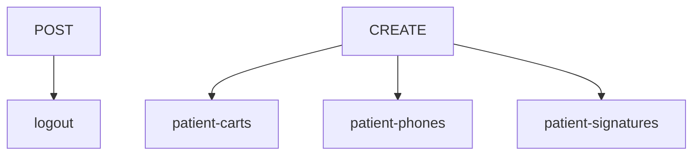
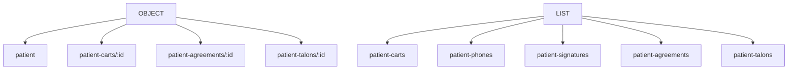
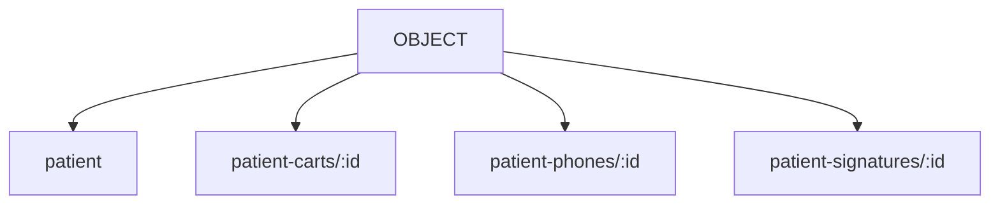
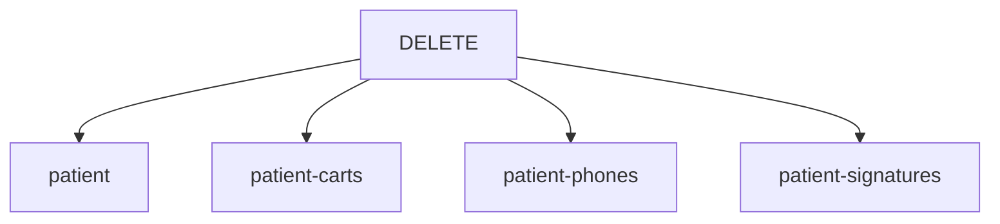

# API пациента
## POST запросы

```mermaid
flowchart TD
POST   --> logout
CREATE --> patient-carts
CREATE --> patient-phones
CREATE --> patient-signatures
```
## GET запросы

```mermaid
flowchart TD
OBJECT --> patient
LIST   --> patient-carts
OBJECT --> patient-carts/:id
LIST   --> patient-phones
LIST   --> patient-signatures
LIST   --> patient-agreements
OBJECT --> patient-agreements/:id
LIST   --> patient-talons
OBJECT --> patient-talons/:id
```
## PUT/PATCH запросы

```mermaid
flowchart TD
OBJECT --> patient
OBJECT --> patient-carts/:id   
OBJECT --> patient-phones/:id
OBJECT --> patient-signatures/:id
```
## DELETE запросы

```mermaid
flowchart TD
DELETE --> patient
DELETE --> patient-carts
DELETE --> patient-phones
DELETE --> patient-signatures   
```