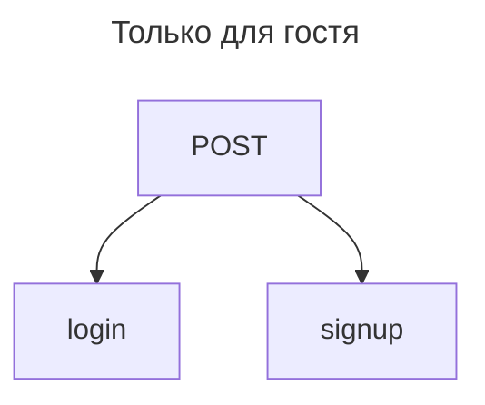
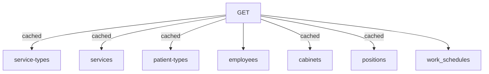

# API общедоступное
### POST запросы

```mermaid
---
title: Только для гостя
---
flowchart TD
    POST --> login
    POST --> signup
```
### GET запросы

```mermaid
flowchart TD
    GET -- cached --> service-types
    GET -- cached --> services
    GET -- cached --> patient-types
    GET --> employees
    GET -- cached --> cabinets
    GET -- cached --> positions
    GET --> work_schedules
```
